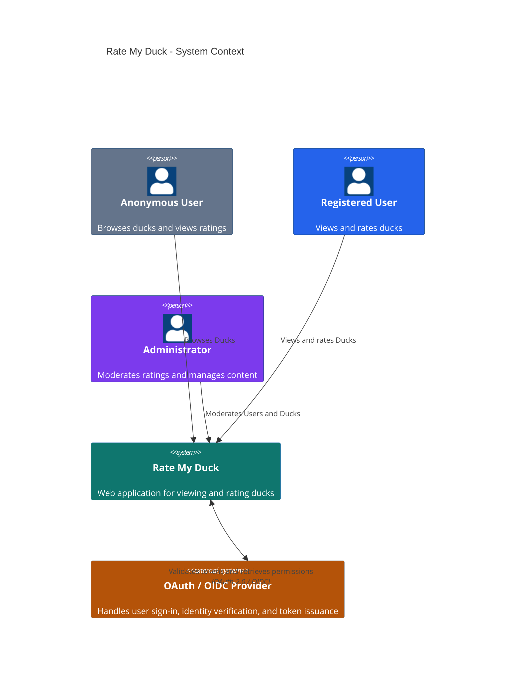
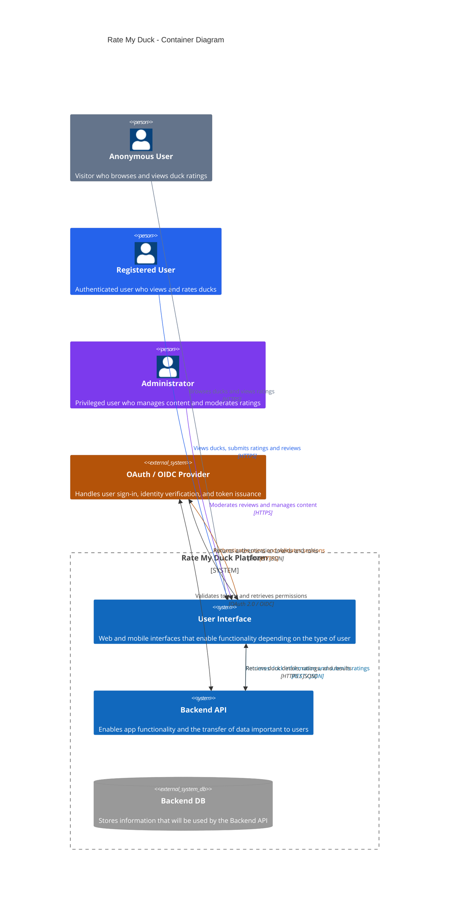

```mermaid
C4Context
    title Rate My Duck - System Context

    Person(anonymous, "Anonymous User", "Browses ducks and views ratings")
    Person(registered, "Registered User", "Views and rates ducks")
    Person(admin, "Administrator", "Moderates ratings and manages content")

    System(software, "Rate My Duck", "Web application for viewing and rating ducks")

    System_Ext(coreAuth, "OAuth / OIDC Provider", "Handles user sign-in, identity verification, and token issuance")

    Rel_R(anonymous, software, "Browses Ducks")
    Rel_R(registered, software, "Views and rates Ducks")
    Rel_R(admin, software, "Moderates Users and Ducks")
    BiRel(software, coreAuth, "Validates tokens and retrieves permissions", "OAuth 2.0 / OIDC")

    UpdateElementStyle(anonymous, $bgColor="#64748b", $fontColor="#ffffff")
    UpdateElementStyle(registered, $bgColor="#2563eb", $fontColor="#ffffff")
    UpdateElementStyle(admin, $bgColor="#7c3aed", $fontColor="#ffffff")
    UpdateElementStyle(software, $bgColor="#0f766e", $fontColor="#ffffff")
    UpdateElementStyle(coreAuth, $bgColor="#b45309", $fontColor="#ffffff")
    
    UpdateRelStyle(software, coreAuth, $offsetX="-100", $offsetY="65")
    %% Shifts label between Rate My Duck and Oauth so that its readable
    UpdateRelStyle(software, coreAuth, $offsetX="-100", $offsetY="65")

    %% 3 actors/parts of diagram per row, used to make users appear at top
    UpdateLayoutConfig($c4ShapeInRow="3", $c4BoundaryInRow="1")
```

```mermaid
C4Context
    title Rate My Duck - Container Diagram

    Person(anonymous, "Anonymous User", "Visitor who browses and views duck ratings")
    Person(registered, "Registered User", "Authenticated user who views and rates ducks")
    Person(admin, "Administrator", "Privileged user who manages content and moderates ratings")

    System_Boundary(rmd, "Rate My Duck Platform") {
        System(ui, "User Interface", "Web and mobile interfaces that enable functionality depending on the type of user")
        System(api, "Backend API", "Enables app functionality and the transfer of data important to users")
        SystemDb_Ext(db, "Backend DB", "Stores information that will be used by the Backend API")
    }
    
     System_Ext(coreAuth, "OAuth / OIDC Provider", "Handles user sign-in, identity verification, and token issuance")
    

    Rel(anonymous, ui, "Browses ducks and views ratings", "HTTPS")
    Rel(registered, ui, "Views ducks, submits ratings and reviews", "HTTPS")
    Rel(admin, ui, "Moderates reviews and manages content", "HTTPS")

    Rel(ui, api, "Retrieves duck information and submits ratings", "REST / JSON")
    Rel(api, ui, "Returns duck details, ratings, and results", "HTTPS / JSON")

    Rel(ui, coreAuth, "Authenticates users and validates sessions", "HTTPS")
    Rel(coreAuth, ui, "Returns authentication tokens and roles", "HTTPS / JSON")
    
        BiRel(api, coreAuth, "Validates tokens and retrieves permissions", "OAuth 2.0 / OIDC")

    UpdateElementStyle(anonymous, $bgColor="#64748b", $fontColor="#ffffff", $borderColor="#475569")
    UpdateElementStyle(registered, $bgColor="#2563eb", $fontColor="#ffffff", $borderColor="#1d4ed8")
    UpdateElementStyle(admin, $bgColor="#7c3aed", $fontColor="#ffffff", $borderColor="#6d28d9")

    UpdateElementStyle(software, $bgColor="#0f766e", $fontColor="#ffffff", $borderColor="#115e59")
    UpdateElementStyle(coreApi, $bgColor="#0369a1", $fontColor="#ffffff", $borderColor="#075985")
    UpdateElementStyle(coreAuth, $bgColor="#b45309", $fontColor="#ffffff", $borderColor="#92400e")

    UpdateRelStyle(anonymous, ui, $textColor="#64748b", $lineColor="#64748b")
    UpdateRelStyle(registered, ui, $textColor="#2563eb", $lineColor="#2563eb")
    UpdateRelStyle(admin, ui, $textColor="#7c3aed", $lineColor="#7c3aed")

    UpdateRelStyle(ui, api, $textColor="#0369a1", $lineColor="#0369a1")
    UpdateRelStyle(ui, coreAuth, $textColor="#b45309", $lineColor="#b45309")

    UpdateLayoutConfig($c4ShapeInRow="3", $c4BoundaryInRow="1")
```