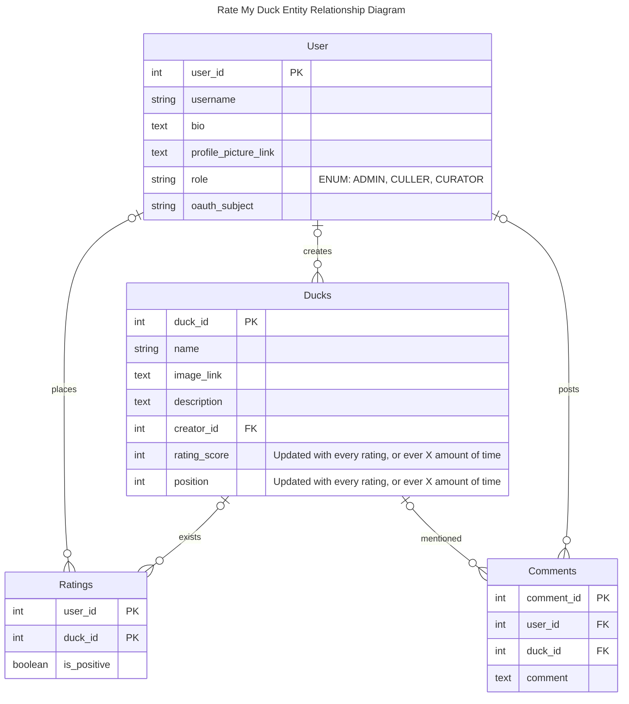

```mermaid
---
title: Rate My Duck Entity Relationship Diagram
---
erDiagram
    Ducks {
        int duck_id PK
        string name
        text image_link
        text description
        int creator_id FK
        int rating_score "Updated with every rating, or ever X amount of time"
        int position "Updated with every rating, or ever X amount of time"
    }
    
    User {
        int user_id PK
        string username
        text bio
        text profile_picture_link
        string role "ENUM: ADMIN, CULLER, CURATOR"
        string oauth_subject
    }
    
    Ratings {
        int user_id PK
        int duck_id PK
        boolean is_positive
    }
    
    Comments {
        int comment_id PK
        int user_id FK
        int duck_id FK
        text comment
    }
    
    
    
    Ducks |o--o{ Ratings : exists
    User |o--o{ Ducks : creates
    User |o--o{ Ratings: places
    User |o--o{ Comments: posts
    Ducks |o--o{ Comments: mentioned
```